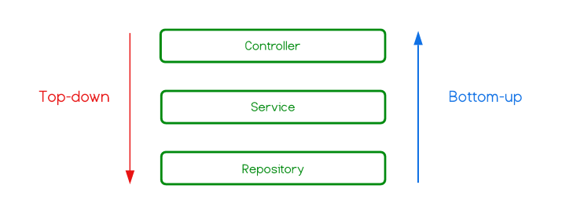

# TDD

Test-driven development (TDD) is a software development process relying on software requirements
being converted to test cases before software is fully developed, and tracking all software development
by repeatedly testing the software against all test cases. This is as opposed to software being developed
first and test cases created later.
Software engineer Kent Beck, who is credited with having developed or "rediscovered" the technique,
stated in 2003 that TDD encourages simple designs and inspires confidence.

Test-driven development is related to the test-first programming concepts of extreme programming,
begun in 1999, but more recently has created more general interest in its own right.

## Red - Green - Refactor

- Write test before production code
- First test must fail (RED)
- Write simplest code passing the test (GREEN)
- Refactor
- Don’t write any test before passing existing ones

## Bottom Up

When Kent Beck first presented TDD, it was bottom-up. This approach is classissist way.
There are no mocks or stubs. Starting with lowest components Red-Green-Refactor cycle runs.
I think this is more robust way since developer test highest level components such as controllers
with exactly working components not with stubs. Another advantage is that several developers
working on same code can reuse existing tests.

## Top Down

Mockist or **outsidein** or Top-down approach.
Developer starts writing tests for highest level components first and mock dependent objects.
That way there happens little test doubles contrary to classissist way therefore decreases refactoring cost.
Another advantage is on the integration side. This approach emphasizes integration of higher level components
prior to development of lower components. Thus, it allows to design your solution better than classisist way.

## BDD

In software engineering, behavior-driven development (BDD) is an agile software development process that
encourages collaboration among developers, quality assurance testers, and customer representatives in a
software project. It encourages teams to use conversation and concrete examples to formalize a shared
understanding of how the application should behave. It emerged from test-driven development (TDD).
Behavior-driven development combines the general techniques and principles of TDD with ideas from
domain-driven design and object-oriented analysis and design to provide software development and
management teams with shared tools and a shared process to collaborate on software development.